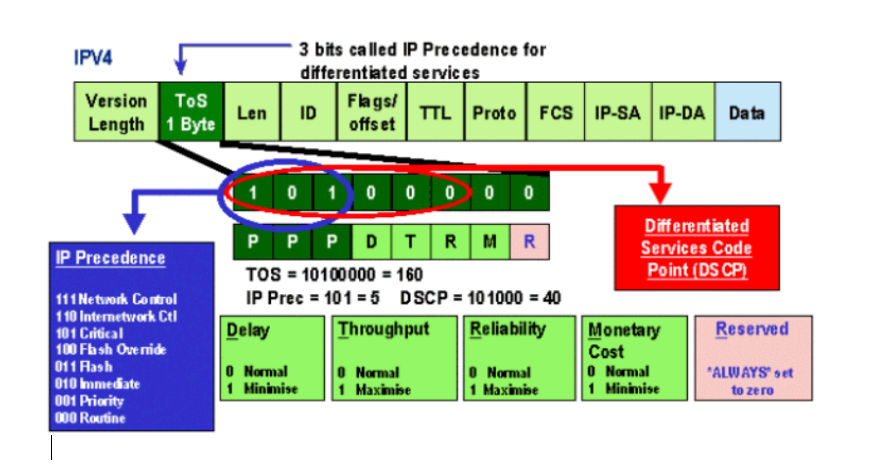

## TOS (IP Precedence), IntServ and DiffServ - Introduction
- layer-3 QoS Mechanism for classifying and managing network traffic and providing quality of service (QoS) on modern IP networks.

## TOS and IP Precedence
- IP packets have a field called the Type of Service field (also known as the TOS byte).
- The original idea behind the TOS byte was that we could specify a priority and request a route for high throughput, low delay and high reliable service.

- Initially 8 bits of the TOS byte were defined as **precedence** and **type of service**

| TOS Field | Size | Description | 
|:-:|:-:|:-:|
| Precedence | 3 Bits | Higher the value, more important the IP packet |
| Type of Service | 4 Bits | Defined kind of delay, throughput and reliability |
| MBZ | 1 Bits | Must Be Zero |

### Precedence Table

Bits | Description
|:-:|:-:|
000  |  Routine
001  |  Priority
010  |  Immediate
011  |  Flash
100  |  Flash Override
101  |  Critic/Critical
110  |  Internetwork Control
111  |  Network Control

### Type of Service Table

Bits | Description
|:-:|:-:|
1000  |  minimize delay
0100  |  maximize throughput
0010  |  maximize reliability
0001  |  minimize monetary cost
0000  |  normal service

## IntServ (Integrated Services) - Introduction

- Network in above diagram has 3 routers and 2 voip phones
- Need ene to end QoS to desired end user experience
- Two ways to make it happen.
  - End to End Resource Reservation: called **IntServ (Integrated Services)**
  - End to End Marking and Priotization: Called **DiffServ (Differentiated Servicess)**

### Difference Between IntServ and DiffServ

DiffServ | IntServ
|:-:|:-:|
Coarse Grained | Fine Grained 
No Admission Control | Admission Control
No Signalling | Uses Signalling (RSVP Protocol)
Mark packate and send to Network | End to End Resource Reservation Required
Simple and Scalable | Complex to implement
Apprepriate for Aggregate flows | Per Flow Based 
Aggregate Flow Classification  | Per Flow Classification
No Complex Buffer Management | Per Flow Buffer Management
Aggregate Flow Scheduling | Per Flow Scheduling
Efficient Network Managment | Complex Network Managment 
Domain Specific Scope | End to End Scope
Long Term Setup | Per Flow Setup

## Differentiated Servicess (DiffServ)
- New model in which traffic is treated by intermediate systems (per-hop behavior (PHB)) with relative priorities based on the type of services (ToS) field.
- Defined in RFC 2474 and RFC 2475
- The TOS byte is renamed to DS field
- PHB (Per Hop behavior): QoS functions are implemented per-hop
- DiffServ uses a 6-bit **differentiated services code point (DSCP)**
- Supercedes IP TOS (IP precedence) and Integrated services (IntServ)
- PHB implements: Packet classification and traffic conditioning functions, such as metering, marking, shaping, and policing.

> 6 Bits: 64 available DSCP values.

### DiffServ Domain
- A group of routers that implement common, administratively defined DiffServ policies are referred to as a DiffServ domain.

### PHB: Per Hop Behavior
- Packet classification and traffic conditioning functions, such as metering, marking, shaping, and policing defined on per Hop routers.

### Classification and marking

#### Traffic classifiers
- Edge routers in a DiffServ domain assign individual packets to a specific traffic class based on parameters like SA, DA, Traffic type etc.
- Traffic Class is marked into the DS field in the IP header as DSCP codes.
- 64 different traffic classes possible using the 64 available DSCP values
- But, RFCs recommends, but do not require, certain encodings

RFC Recommended Encodings | Description
|:-:|:-:|
Default Forwarding (DF) PHB | typically best-effort traffic
Expedited Forwarding (EF) PHB | low-loss, low-latency traffic
Assured Forwarding (AF) PHB | assurance of delivery under prescribed conditions
Class Selector PHB | backward compatibility with the IP precedence 

#### RFC 4594 recommendations for DSCP values

Service Class | DSCP  |  Conditioning at DS Edge | PHB Used | Queuing  |  AQM
|:-:|:-:|:-:|:-:|:-:|:-:|
Network Control  |  CS6  |  See Section 3.1  |  RFC2474  |  Rate  |  Yes
Telephony  |  EF  |  Police using sr+bs  |  RFC3246  |  Priority  |  No
Signaling  |  CS5  |  Police using sr+bs  |  RFC2474  |  Rate  |  No
Multimedia Conferencing  |  AF41, AF42, AF43  |  Using two-rate, three-color marker (such as RFC 2698)  |  RFC2597  |  Rate  |  Yes per DSCP
Real-Time Interactive  |  CS4  |  Police using sr+bs  |  RFC2474  |  Rate  |  No
Multimedia Streaming  |  AF31, AF32, AF33  |  Using two-rate, three-color marker (such as RFC 2698)  |  RFC2597  |  Rate  |  Yes per DSCP
Broadcast Video  |  CS3  |  Police using sr+bs  |  RFC2474  |  Rate  |  No
Low-Latency Data  |  AF21, AF22, AF23  |  Using two-rate, three-color marker (such as RFC 2698)  |  RFC2597  |  Rate  |  Yes per DSCP
OAM  |  CS2  |  Police using sr+bs  |  RFC2474  |  Rate  |  Yes
High-Throughput Data  |  AF11, AF12, AF13  |  Using two-rate, three-color marker (such as RFC 2698)  |  RFC2597  |  Rate  |  Yes per DSCP
Standard  |  DF  |  Not applicable  |  RFC2474  |  Rate  |  Yes
Low-Priority Data  |  CS1  |  Not applicable  |  RFC3662  |  Rate  |  Yes

## References

[https://en.wikipedia.org/wiki/Differentiated_services](https://en.wikipedia.org/wiki/Differentiated_services)

[https://support.huawei.com/enterprise/en/doc/EDOC1100093981/78a80087/dscp-and-phb]([https://link](https://support.huawei.com/enterprise/en/doc/EDOC1100093981/78a80087/dscp-and-phb))

